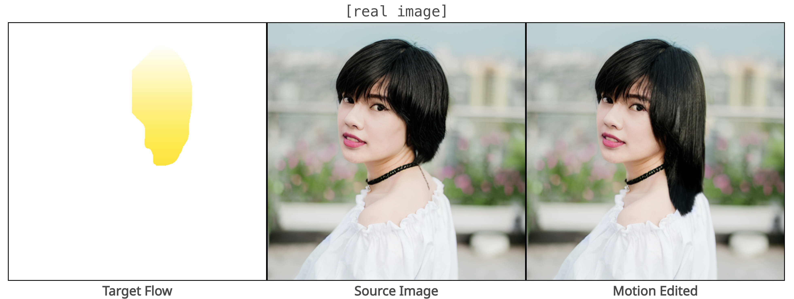

# Motion Guidance: Diffusion-Based Image Editing with Differentiable Motion Estimators

[Daniel Geng](https://dangeng.github.io/), [Andrew Owens](https://andrewowens.com/)

## [[arXiv]()] [[Website](https://dangeng.github.io/motion_guidance/)]

This project aims to allow editing of images based on motion. Given a flow field that indicates "what should move where," our method synthesizes a new image according to this motion. We do this by using off-the-shelf diffusion models, with no training or finetuning.





## Getting Started

Install and activate the conda environment:

```
conda env create -f environment.yml
conda activate motion_guidance
```

Download RAFT checkpoints, copy the `raft-things.pth` checkpoint to correct location, and clean up:

```
wget https://dl.dropboxusercontent.com/s/4j4z58wuv8o0mfz/models.zip
unzip models.zip
mv ./models/raft-things.pth ./flow_models/raft/
rm -r models
```

Download the Stable Diffusion v1.4 checkpoint to a new directory called `chkpts`:

```
mkdir chkpts
cd chkpts
wget https://huggingface.co/CompVis/stable-diffusion-v-1-4-original/resolve/main/sd-v1-4.ckpt
```

Download images, flows, and other necessary metadata. The result should be a directory called `data` in the root directory of this repo:

```
# md5sum: 15e065d5987c3e128b6484dbb879d0b1
wget -O motion_guidance_data.tar.gz https://www.dropbox.com/scl/fi/1njzduhyiotlww5ydtfs1/motion_guidance_data.tar.gz?rlkey=qaiovz0ir8n8kdqvwfegw0zld&dl=1
tar -xvf motion_guidance_data.tar.gz
rm motion_guidance_data.tar.gz
```

## Running

Run this command to move the teapot in the `teapot` image down:

```
python ./generate.py --prompt "a teapot floating in water" --input_dir ./data/teapot --edit_mask_path down150.mask.pth --target_flow_name down150.pth --use_cached_latents --save_dir results/teapot.down150 --log_freq 25
```

### Args Overview

Here is a brief description of all the args:

- `--prompt`: The text prompt for the model. Can be empty for real images
- `--input_dir`: The path to directory containing image, flow, and cached latents
- `--edit_mask_path`: Name of the edit mask
- `--target_flow_name`: Name of the target flow
- `--guidance_schedule_path`: Path to the guidance schedule
- `--ckpt`: Path to the Stable Diffusion v1.4 checkpoint
- `--num_recursive_steps`: Number of recursive steps to take
- `--guidance_weight`: Factor to multiply guidance by
- `--color_weight`: Factor to weight color loss
- `--flow_weight`: Factor to weight flow loss
- `--no_occlusion_masking`: If specified, do not mask occlusions for the color loss
- `--clip_grad`: If non-zero, then clip gradient to this norm
- `--use_cached_latents`: If specified, then use cached latents for copying outside of edit mask. Otherwise, inject noise (run forward process) for copying.
- `--no_init_startzt`: If specified, do not initialize the noise estimate with the same noise that generated the image. (n.b. Fairly certain this is not necessary, but including for completeness as it was used in the paper)
- `--save_dir`: Path to directory to save results and metadata
- `--log_freq`: How often to save info (reconstructed image, flows visualizations)

### Files Overview

Here is a brief description of important files in the codebase:

- `generate.py`: The main entry point for generating motion guided images. Does arg parsing, creates the models, samplers, and guidance energy objects.
- `ldm/models/diffusion/ddim_with_grad.py`: Implements DDIM, with recursive sampling, edit mask copying, and gradients through the guidance energy.
- `losses.py`: Implements the guidance energy.


### More Examples

Move apple right:

```
python ./generate.py --prompt "an apple on a wooden table" --input_dir ./data/apple --edit_mask_path right.mask.pth --target_flow_name right.pth --use_cached_latents --save_dir results/apple.right --log_freq 5
```

Deform topiary trees:

```
python ./generate.py --prompt "a photo of topiary" --input_dir ./data/topiary --edit_mask_path mask.pth --target_flow_name flow.pth --use_cached_latents --save_dir results/topiary --log_freq 5
```

Move lion to the left and disocclude:

```
python ./generate.py --prompt "a photo of a lion" --input_dir ./data/lion --edit_mask_path left.mask.pth --target_flow_name left.pth --use_cached_latents --save_dir results/lion.left --log_freq 5
```

Squeeze the painting of a tree, making it skinnier:

```
python ./generate.py --prompt "a painting of a lone tree" --input_dir ./data/tree --edit_mask_path squeeze.mask.pth --target_flow_name squeeze.pth --use_cached_latents --save_dir results/tree.squeeze --log_freq 5
```

Make woman's hair longer (real image, cached latents obtained through inversion):

```
python ./generate.py --prompt "" --input_dir ./data/woman --edit_mask_path growHair.mask.pth --target_flow_name growHair.pth --use_cached_latents --save_dir results/woman.growHair --log_freq 5
```
